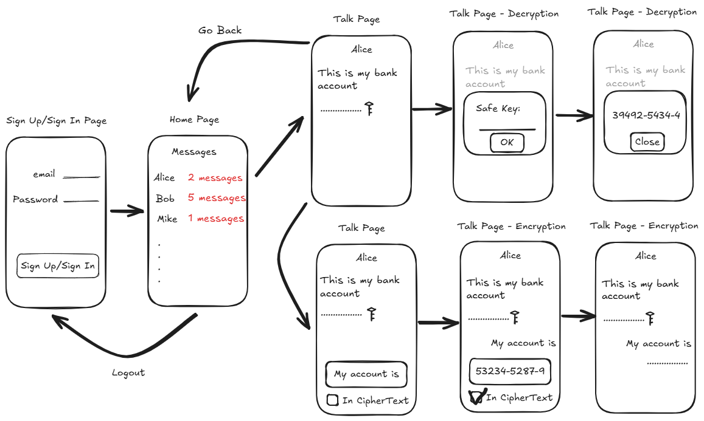
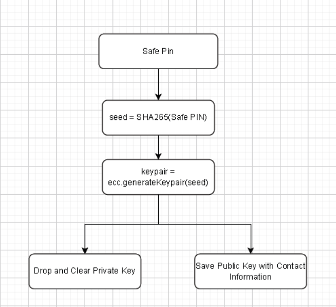
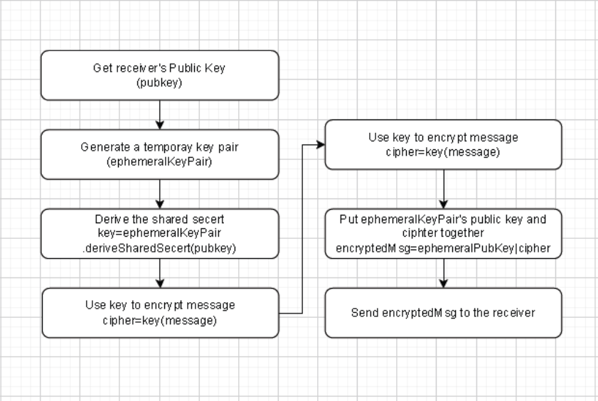
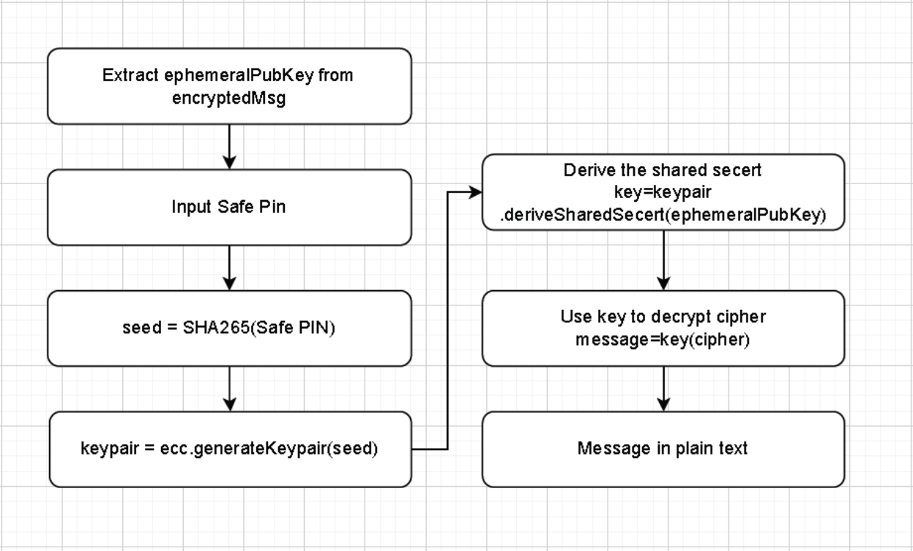
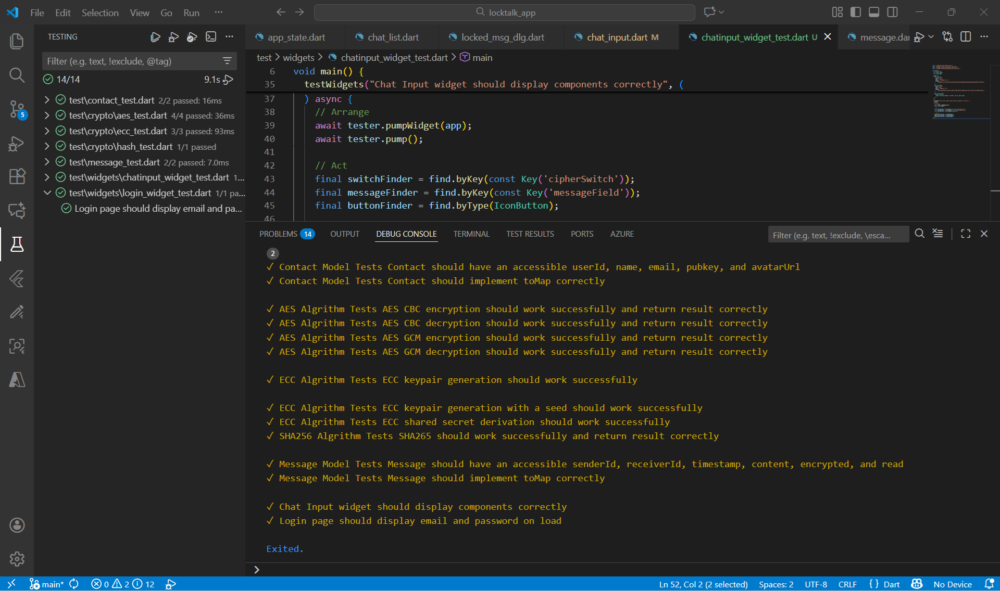

# DMIT2504 - Project App Development: LockTalk App

- This project is a mobile app development project of DMIT2504 - Mobile Application Development.

- LockTalk is a mobile app for secure chat, which applies asymmetric encryption and symmetric encryption to protect messages and makes sure only the receiver can read.

- Specifically, the following cryptographic algorithms were used.
  - SHA265
  - ECC
  - AES

## Purpose

We often send sensitive information to others online, such as:

- Bank account information
- Username/password
- Mobile phone number
- Private messages

There are many security risks associated with transmitting and storing this information on the internet.

Sometimes we also hope that the information on our phones won't be seen by others.

You can do above goals with LockTalk!

LockTalk allows senders to encrypt each message individually before sending, ensuring that the messages are encrypted during transmission and storage over the internet. On the recipient's phone, an encrypted message will not be automatically decrypted and displayed in plaintext; instead, it will show "Encrypted Message." The recipient can only see the original text after entering the correct security PIN.

Most importantly, the encryption key is derived from the recipient's Safe PIN each time, so only the corresponding message recipient can decrypt the message.

In this way, Locktalk can ensure the security of your messages during transmission, storage, and reading.

## Archicteture

Below is the architecture diagram of this App.



## How does it work

### Key pair generation process

LockTalk generates an asymmetric key pair (ECC) for each user during signing up.

- Step1: Users set a Safe Pin when they creating account on LockTalk.
- Step2: LockTalk performs SHA256 operation on the Safe PIN.
- Step3: The result will be used as the seed to generate an ECC key pair for users.
- Step4: The private key will be dropped and cleared, while the public key will be saved with users contact information on Firebase.

Below is the workflow diagram of this process



### Message encryption prcess

When a message sender wants to send a message in encrypted, LockTalk will do following steps.

- Step1: Sender get the receiver's public key from the contact information.
- Step2: Sender generates a temporary key pair, named ephemeralKeyPair.
- Step3: Sender derives the shared secert key with ephemeralKeyPair and receiver's public key.
- Step4: Sender uses the shared secert key to encrypt this message.
- Step5: Sender put ephemeralKeyPair's public key (named ephemeralPublicKey) and the encrypted message together and then post them to the receiver.

Below is the workflow diagram of this process



### Message decryption prcess

When the receiver received an encrypted message and wants to read it, LockTalk will do following steps.

- Step1: Receiver tap the encrypted message, and extract the ephemeralPublicKey from it.
- Step2: Receiver input his Safe PIN, and performs SHA256 operation on the Safe PIN.
- Step3: The result will be used as the seed to generate an ECC key pair for the receiver.
- Step4: Sender derives the shared secert key with his key pair and ephemeralPublicKey.
- Step4: Sender uses the shared secret key to decrypt cipher, then get the origin message in plain text.

Below is the workflow diagram of this process



## How to build

You can build this project following below steps.

- Clone this project code to your local

```
    $ git clone https://github.com/Hansenyao/locktalk_app.git
```

- Change current path to project folder

```
    $ cd locktalk_app
```

- Use Visual Code to open project folder

- Install dependent packages

```
    $ flutter pub get
```

- Select a device and run it!

## How to test

You can run test cases using one of below options

- Option A: run test command

```
    $ flutter test
```

- Option B: Use Visual Code Testing menu on the left bar, then click "Run Tests"

- After all tests are finished, you will see information like



## How to use

You can use this App as below.

- Open app then select "Create a new account" link to navigate to sign up page.
- Input your email and password for account generation.
- Input your individual Safe PIN. Please remember your SafePIN. If you forget it, you will be unable to decrypt your encrypted messages.
- After your sign up successfully, go to Contact page and select one you want to chat with
- On the chat page, you can select CipherText model to send an encrypted message.

Good luck!
